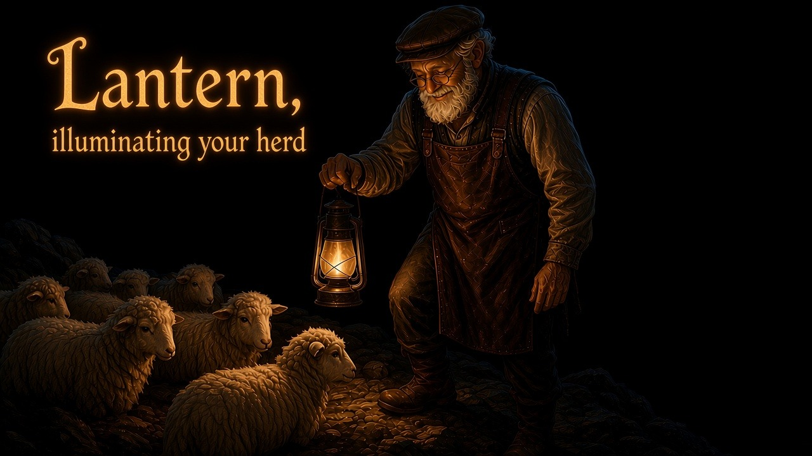

# Lantern, by Elves



**v0.3.0** — a [Herdr](https://herdr.dev) plugin (`aigora.lantern`).

From the team that brought you [Elves](https://github.com/aigorahub/elves).

Herdr manages the herd. The herd is in the field. Lantern illuminates
the field: who needs you, what they are working toward, jump to a pane,
start a new agent. The sidebar already marks working, blocked, done, or
idle. This plugin does not replace Herdr or wrap the agent CLIs.

It opens as a chat tab in its own Herdr workspace and starts the helper CLI
you already use (Cursor `agent`, Devin, Claude Code, Codex, or Grok). That
CLI drives `herdr`.

Requires Herdr **0.7.5+** on macOS or Linux.

## Install the plugin

From the marketplace / GitHub (after this release is on `main`):

```bash
# If you previously used `herdr plugin link` for this repo, unlink first.
herdr plugin unlink aigora.lantern
herdr plugin install aigorahub/herdr-lantern
```

Local checkout while developing:

```bash
herdr plugin link /path/to/herdr-lantern
```

Do not run link and GitHub install at the same time for the same plugin id.

## Pick your helper CLI

The lantern chat runs **one** CLI. That is independent of
`HELPER_SPAWN_KIND`, which is only the default `--kind` when the helper starts
an agent for your work (usually `claude`).

Leave `HELPER_AGENT` empty to use the first of `agent`, `devin`, `claude`, `codex`,
`grok` on `PATH`. Launch prepends `~/.local/bin`, `~/bin`, and Homebrew.

| Helper you want | Install that CLI | `helper.conf` |
| --- | --- | --- |
| Cursor Ultra | Cursor CLI on `PATH` as `agent` (also `cursor-agent`) | `HELPER_AGENT="agent"` · `HELPER_MODEL="cursor-grok-4.6-high-fast"` (empty also defaults to that) · `HELPER_PERMISSION="smart"` (`--auto-review`) |
| Devin | [Devin CLI](https://docs.devin.ai) — typically `~/.local/bin/devin` | `HELPER_AGENT="devin"` · leave `HELPER_MODEL` empty (Free rejects `--model`; Devin uses `~/.config/devin/config.json`) · `HELPER_PERMISSION="smart"` |
| Claude Code | [Claude Code](https://code.claude.com/docs) on `PATH` as `claude` | `HELPER_AGENT="claude"` · optional `HELPER_MODEL` · optional `HELPER_EFFORT` (`--effort`) |
| Codex | [Codex CLI](https://github.com/openai/codex) on `PATH` as `codex` | `HELPER_AGENT="codex"` · optional `HELPER_MODEL` · optional `HELPER_EFFORT` (`model_reasoning_effort`) |
| Grok | Grok CLI on `PATH` as `grok` (often `~/.grok/bin`) | `HELPER_AGENT="grok"` · optional `HELPER_MODEL` · optional `HELPER_EFFORT` (`--reasoning-effort`) |

Each person on the team sets their own file. Nobody shares one model string.

```bash
$EDITOR "$(herdr plugin config-dir aigora.lantern)/helper.conf"
```

```sh
HELPER_AGENT="agent"         # agent, devin, claude, codex, grok; empty = first on PATH
HELPER_MODEL="cursor-grok-4.6-high-fast"  # optional --model; leave empty for Devin
HELPER_EFFORT=""             # unused for Devin and Cursor agent
HELPER_CWD="~"               # search root mentioned to the helper
HELPER_SPAWN_KIND="claude"   # default --kind for `herdr agent start`
HELPER_PERMISSION="smart"    # devin / agent: auto | accept-edits | smart | dangerous
HELPER_EXTRA_ARGS=""         # extra unquoted CLI tokens
```

`launch.sh` parses `KEY=value` only; it does not source the file as shell.

The helper prompt is copied once to `prompt.md` in the same config directory
and is never overwritten. After upgrading the plugin, copy the new
`prompt.md` from the repo over that file if you want the latest rules. Devin
also gets the same text as `.windsurf/rules/lantern.md` in the plugin
state workdir. Cursor `agent` gets `.cursor/rules/lantern.mdc`. Claude
Code gets `CLAUDE.md`.

On light-up it snapshots the field (`bin/goals-floor`): pane titles, Claude
`/goal` / recap lines, and who is waiting on you. Ask “what are they
working toward?” for that readout.

Lantern works great with Elves. Without Elves it is still the Herdr
plugin: workspaces, panes, agents. If `.elves-session.json` files exist,
it also snapshots those runs (`bin/elves-floor`). Ask “how’s the night
shift?” It does not cobble or land.

Mutating `herdr` commands (create, start, focus, close, …) go through
`bin/herdr`. After you confirm a path or target, the helper reruns with
`HERDR_HELPER_OK=1`.

How to use it (GitHub Pages, after this lands on `main`):
[aigorahub.github.io/herdr-lantern](https://aigorahub.github.io/herdr-lantern/).
Team setup notes: [howto.html](howto.html). Changelog: [CHANGELOG.md](CHANGELOG.md).

## Open it

```bash
hsh
```

That runs `herdr plugin action invoke aigora.lantern.open`. Put `hsh`
from this repo on your `PATH` (for example `ln -s "$PWD/hsh" ~/bin/hsh`).

Once it is installed, open it in Herdr with **Ctrl+B, then capital H**.
`prefix+h` is already “focus pane left”, so the binding has to be capital H:

```toml
[[keys.command]]
key = "prefix+H"
type = "plugin_action"
command = "aigora.lantern.open"
description = "Open lantern"
```

Then `herdr server reload-config`. No Herdr restart is needed for plugin
script or config edits; reopen the lantern.

## Where it sits

The first open creates a workspace labelled **🔥 lantern** at your home
directory and seats the chat there as a tab named **field**. It does not
drop a tab into whatever workspace you are in, and it closes the empty
shell tab the new workspace comes with, so the workspace holds the chat
alone. The lantern in the sidebar is how you find it at a glance.

Every later open reuses it. A chat that is still running is focused
wherever it sits, so moving or renaming that tab is safe. If the chat has
exited, Lantern seats a new one in the same workspace and closes nothing
else. It does not open a second lantern workspace, and two fast key
presses cannot race into two.

Lantern remembers both ids under the plugin state directory
(`workspace.id`, `pane.id`) and checks them before it uses them: Herdr
reuses ids after a restart, so a remembered workspace counts only while it
still carries the `🔥 lantern` label, and a remembered pane only while it
is still a lantern chat. Keep that label if you want the workspace reused
after the chat closes. Rename it and the next open makes a fresh one.

A new workspace lands **last** in the sidebar. There is no pin-to-top;
drag it where you want it.

The chat runs in the plugin state workdir. Home is only where the
workspace sits and the search root the helper is told about
(`HELPER_CWD`). Your repositories keep their own workspaces.

The tab closes when the helper CLI exits, and the lantern workspace goes
with it when that chat was the only tab in it. Herdr does not take Escape
until then; Escape stays inside the CLI.

For Cursor `agent`: **Ctrl+C** (twice if a turn is running), or **Ctrl+D** on an
empty prompt.


## Tests

```bash
sh tests/smoke.sh
```

## Trust

This runs as your user with your environment. Read `launch.sh`, `lib.sh`, and
`bin/herdr` before installing. Devin `HELPER_PERMISSION=dangerous` skips
Devin’s own approval UI; the herdr wrapper still requires `HERDR_HELPER_OK=1`
for mutating commands.
